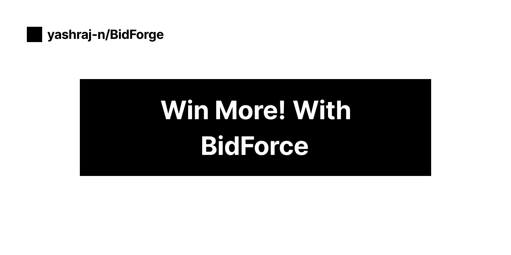
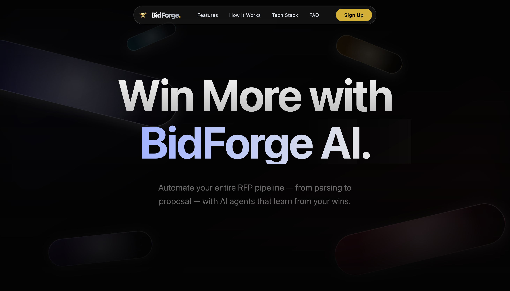
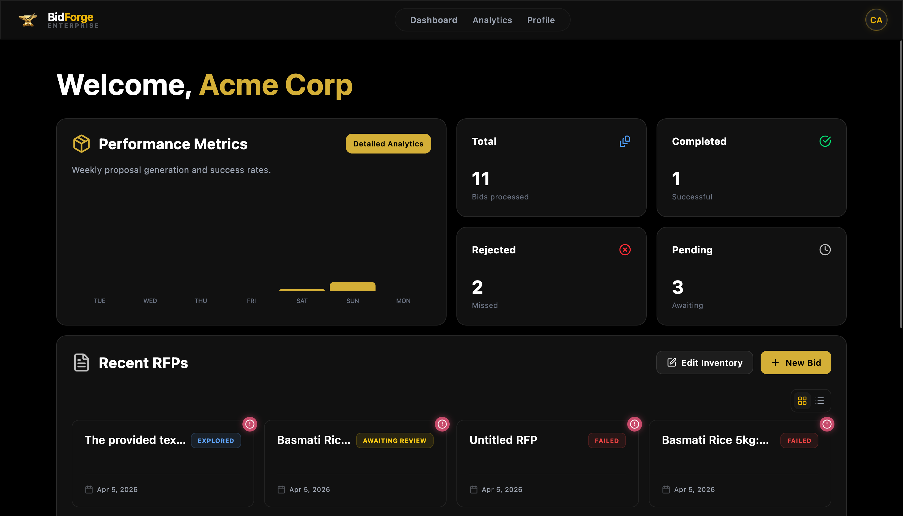
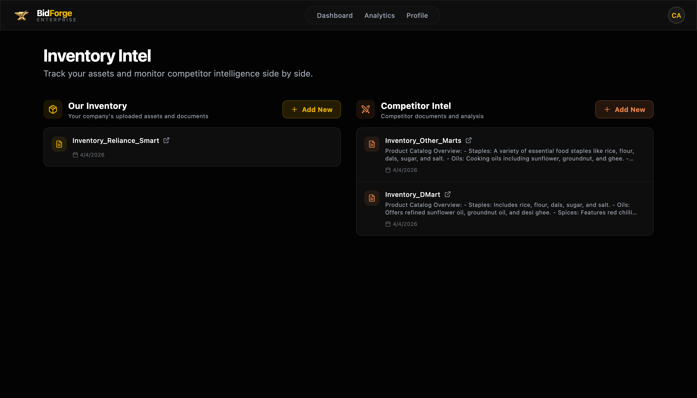
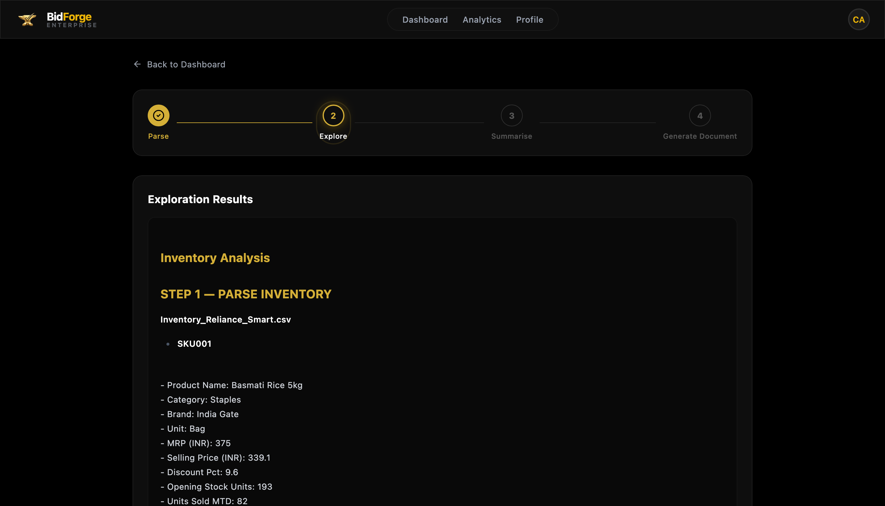
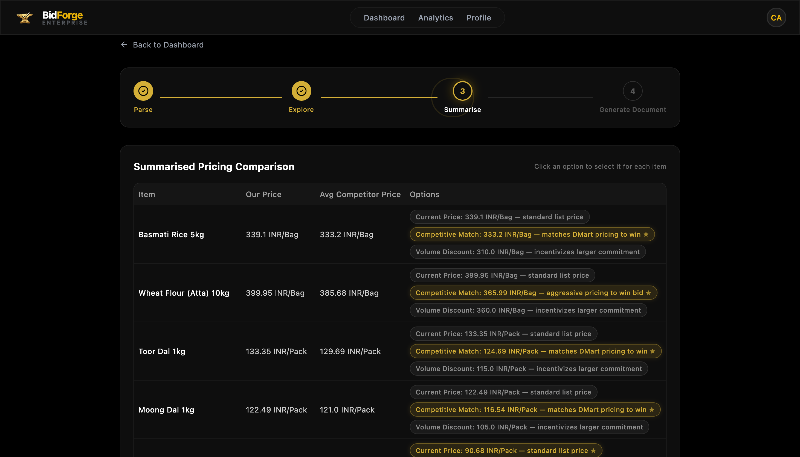
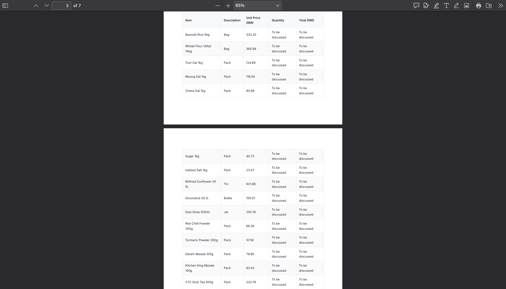
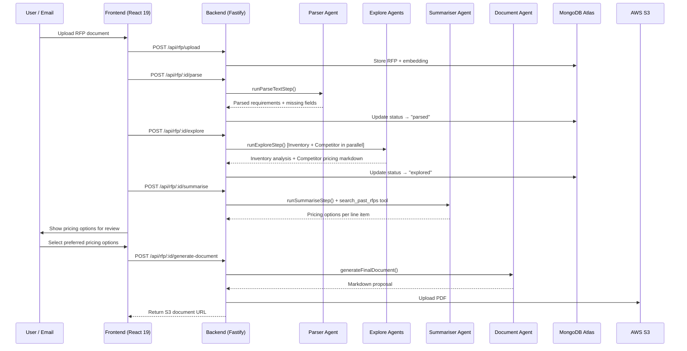
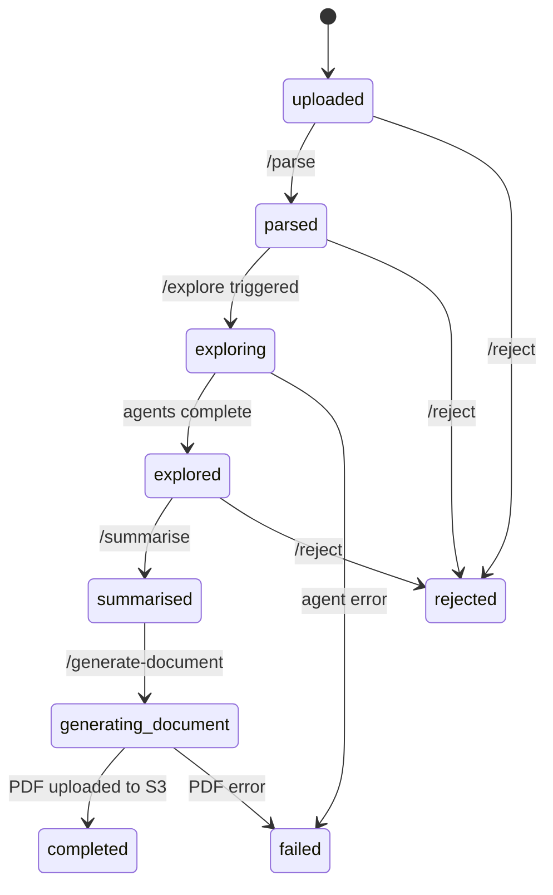
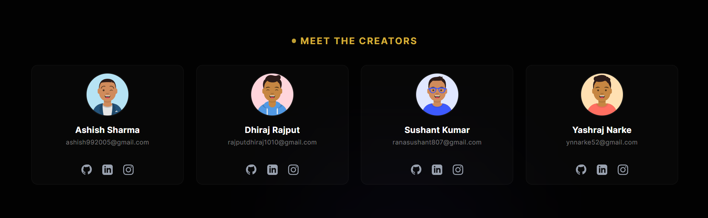

<p align="center">
  
</p>

# BidForge

_The AI-native platform that turns raw RFPs into winning proposals — automatically._

    [](LICENSE)

---

## 📖 Overview

Companies juggle dozens of RFPs every quarter, each demanding hours of cross-referencing inventory, benchmarking competitors, and writing polished proposals from scratch. **BidForge eliminates that grind.** Upload an RFP document and a five-agent AI pipeline takes over — parsing requirements, matching line items against your product catalog via RAG, pulling live market pricing through SerpAPI, and synthesizing a competitive pricing strategy. Before the final PDF is generated, you review and select from recommended pricing options, keeping humans in the loop where it matters. The result is a branded, ready-to-send proposal document uploaded to S3 in minutes, not days.

---

## 📸 Screenshots

<table>
  <tr>
    <td align="center">
      
      <br /><strong>Homepage</strong>
    </td>
    <td align="center">
      
      <br /><strong>Dashboard</strong>
    </td>
  </tr>
  <tr>
    <td align="center">
      
      <br /><strong>Inventory Management</strong>
    </td>
    <td align="center">
      
      <br /><strong>RFP Exploration</strong>
    </td>
  </tr>
  <tr>
    <td align="center">
      
      <br /><strong>Summarised Pricing Options</strong>
    </td>
    <td align="center">
      
      <br /><strong>Final Proposal Artifact</strong>
    </td>
  </tr>
</table>

---

## ✨ Features

- **5-Agent AI Pipeline** — Parse → Explore → Summarise → Generate, each agent is independent and composable
- **Intelligent RFP Parsing** — Extracts requirements, flags missing fields, and cleans raw text using Gemini 2.5 Flash via OpenRouter
- **Inventory RAG** — Matches RFP line items against your uploaded product catalog (PDF, CSV, TXT) stored in S3
- **Competitor Intelligence** — Analyzes uploaded competitor files + fetches live market prices via SerpAPI (IQR-cleaned median pricing)
- **Semantic Search on Past RFPs** — Vector embeddings (HuggingFace `all-MiniLM-L6-v2`) stored in MongoDB Atlas with `$vectorSearch` for cross-RFP learning
- **Human-in-the-Loop Pricing** — Summariser presents 2–3 pricing strategy options per line item; user selects before document generation
- **PDF Export** — Final proposal rendered from Markdown → PDF via `md-to-pdf` (Puppeteer) with branded styling, uploaded to S3
- **Email Ingestion** — Cloudflare Worker receives inbound emails and triggers the pipeline automatically
- **Company Auth** — Email verification flow via Resend, JWT-based session middleware
- **Monorepo** — Bun workspaces with shared `common` package for type-safe event schemas

---

## 🏗️ Architecture



### Monorepo Structure

```
bidforge/
├── apps/
│   ├── backend/          # Fastify API + AI agents (Bun)
│   │   ├── src/
│   │   │   ├── agent/    # 5 AI agents + LLM config
│   │   │   ├── routes/   # auth/, company/, rfp/
│   │   │   └── utils/    # embedding, pricing, s3-client
│   │   └── prisma/       # MongoDB schema
│   ├── frontend/         # React 19 + TanStack Router
│   │   └── src/
│   │       ├── components/
│   │       ├── routes/
│   │       └── store/
│   ├── email-worker/     # Cloudflare Worker (email ingestion)
│   └── common/           # Shared Zod schemas (EmailEvent)
└── assets/               # Screenshots & banner
```

---

## 🛠️ Tech Stack

| Layer | Technology |
|---|---|
| Runtime | Bun |
| Backend Framework | Fastify 5 |
| Frontend | React 19, TanStack Router, Tailwind CSS v4 |
| AI / LLM | LangChain, `@langchain/openrouter` (Gemini 2.5 Flash Lite) |
| Embeddings | HuggingFace Inference (`all-MiniLM-L6-v2`) |
| Vector Search | MongoDB Atlas `$vectorSearch` |
| Database ORM | Prisma 6 (MongoDB) |
| File Storage | AWS S3 (via Bun's `S3Client`) |
| Market Pricing | SerpAPI (Google Shopping) |
| PDF Generation | `md-to-pdf` (Puppeteer) |
| Email Worker | Cloudflare Workers |
| Email Sending | Resend |
| Animations | Framer Motion, GSAP, Lenis |

---

## 🚀 Getting Started

### Prerequisites

- **Bun** ≥ 1.3
- **MongoDB Atlas** cluster with a Vector Search index named `vector_index` on the `RFP` collection, path `embedding`
- **AWS S3** bucket
- Accounts / API keys for: **OpenRouter**, **HuggingFace**, **SerpAPI**, **Resend**

### Clone & Install

```bash
git clone https://github.com/yashraj-n/bidforge.git
cd bidforge
bun install
```

### Environment Variables

Create a file at `apps/backend/.env` with the following variables:

| Variable | Description | Required |
|---|---|---|
| `DATABASE_URL` | MongoDB Atlas connection string | ✅ |
| `OPENROUTER_API_KEY` | OpenRouter API key (for Gemini 2.5 Flash) | ✅ |
| `HUGGINGFACE_API_KEY` | HuggingFace Inference API token | ✅ |
| `AWS_REGION` | AWS region for S3 | ✅ |
| `AWS_ACCESS_KEY_ID` | AWS access key | ✅ |
| `AWS_SECRET_ACCESS_KEY` | AWS secret key | ✅ |
| `S3_BUCKET` | S3 bucket name | ✅ |
| `SERP_API_KEY` | SerpAPI key (live market pricing) | ⚠️ Optional |
| `RESEND_API_KEY` | Resend API key (email verification) | ✅ |
| `JWT_SECRET` | Secret for JWT signing | ✅ |

### Database Setup

```bash
cd apps/backend
bunx prisma generate
bunx prisma db push
```

> [!IMPORTANT]
> You must manually create a **Vector Search index** in the MongoDB Atlas UI on the `RFP` collection:
> - **Index name:** `vector_index`
> - **Field path:** `embedding`
> - **Dimensions:** `384`
> - **Similarity:** `cosine`

### Run Development Servers

```bash
# Backend (port 9000)
cd apps/backend && bun run dev

# Frontend (port 3000)
cd apps/frontend && bun run dev
```

---

## 📡 API Reference

| Method | Endpoint | Auth | Description |
|---|---|---|---|
| `POST` | `/api/signup` | ❌ | Register a new company |
| `POST` | `/api/login` | ❌ | Login, receive JWT |
| `GET` | `/api/me` | ✅ | Get current company profile |
| `POST` | `/api/company/add-inventory` | ✅ | Upload inventory file to S3 |
| `GET` | `/api/company/inventory` | ✅ | List inventory items |
| `POST` | `/api/company/add-competitor` | ✅ | Upload competitor file + AI analysis |
| `GET` | `/api/company/competitors` | ✅ | List competitors |
| `POST` | `/api/rfp/upload` | ✅ | Create RFP record with embedding |
| `POST` | `/api/rfp/:id/parse` | ✅ | Run Parser Agent |
| `POST` | `/api/rfp/:id/explore` | ✅ | Run Inventory + Competitor Agents |
| `POST` | `/api/rfp/:id/summarise` | ✅ | Run Summariser Agent |
| `POST` | `/api/rfp/:id/generate-document` | ✅ | Generate PDF proposal |
| `GET` | `/api/rfp/:id` | ✅ | Get RFP details |
| `GET` | `/api/rfp` | ✅ | List all RFPs |
| `POST` | `/api/rfp/:id/reject` | ✅ | Reject an RFP |
| `POST` | `/api/rfp/:id/reset` | ✅ | Reset RFP to initial state |
| `GET` | `/api/rfp/stats` | ✅ | Get RFP pipeline statistics |
| `GET` | `/api/rfp/search` | ✅ | Semantic search across RFPs |

---

## 🔄 RFP Status Lifecycle



---

## 🤝 Contributing

Contributions are welcome! Here's how to get started:

1. **Fork** the repository
2. **Create a feature branch:** `git checkout -b feat/your-feature`
3. **Commit your changes:** use [Conventional Commits](https://www.conventionalcommits.org/) (`feat:`, `fix:`, `chore:`, `docs:`)
4. **Push** to your fork and **open a Pull Request**

**Branch naming conventions:**

| Prefix | Use case |
|---|---|
| `feat/` | New features |
| `fix/` | Bug fixes |
| `docs/` | Documentation changes |

> [!NOTE]
> Please open an issue before starting work on large changes so we can discuss the approach.

---

## 📝 License

This project is licensed under the **Apache License 2.0** — see the [LICENSE](LICENSE) file for details.

---

<p align="center">
  

  <br /><br />

  If BidForge saves your team hours on proposals, consider giving it a ⭐
  <br /><br />

  Built with ❤️ by 
  <a href="https://github.com/yashraj-n">@yashraj-n</a>, 
  <a href="https://github.com/rsk807">@rsk807</a>,
  <a href="https://github.com/dhiraj-rajput">@dhiraj-rajput</a>,
  <a href="https://github.com/ashish9925">@ashish9925</a>
</p>
